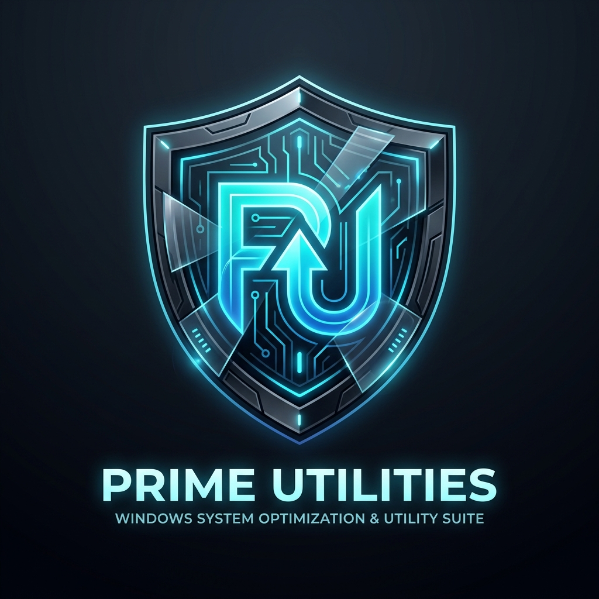

<p align="center">
  
</p>

<h1 align="center">Prime Utilities - Master Windows Suite</h1>

<p align="center">
  
  
  
  
</p>

<p align="center">
  <b>Prime Utilities</b> is an ultra-premium, modern Windows system optimization, debloater, app installer, and diagnostics toolkit inspired by WinUtil. It provides a native WPF Desktop UI and a Web Dashboard paired with robust PowerShell automation.
</p>

---

## 🌟 Key Features

### 📦 1. WinGet Batch Package Manager
* **90+ Curated Applications**: Pre-configured with authentic brand icons and categories (Browsers, Development, Utilities, Gaming, Communications, Multimedia).
* **Batch Operations**: 1-Click Install, Silent Uninstall, and Upgrade All via WinGet.
* **Real-time Live Filter**: Instant search and category filter.

### ⚡ 2. System Tweaks & Privacy Debloater
* **Telemetry & Tracking**: Completely disables Windows Telemetry (`DiagTrack`, `dmwappushservice`) & background data harvesting.
* **AppX Bloatware Removal**: Removes preinstalled bloatware (Solitaire, News, Weather, 3D Builder, Skype).
* **Gaming & Input Tuning**: Disables Xbox GameDVR recording and removes mouse acceleration for raw 1:1 precision input.
* **Power & Performance**: 1-Click toggle for Windows **Ultimate Performance Profile**.
* **O&O ShutUp10++**: Direct integration for advanced privacy controls.

### 🛠️ 3. Config & System Diagnostics
* **SFC & DISM Scans**: System File Checker (`sfc /scannow`) & Component Store repair (`DISM /RestoreHealth`).
* **Network & DNS Reset**: Winsock reset, TCP/IP stack reset, DHCP release/renew, and instant DNS cache flush.
* **Windows Update Repair**: Clears `SoftwareDistribution` cache to resolve stuck Windows Updates.
* **NTP Server Resync**: Force time synchronization with `pool.ntp.org`.
* **Legacy Control Panels**: Quick access shortcuts for Control Panel, Network Connections, Power Options, Sound, Firewall, and System Properties.

### 🔄 4. Windows Update Policy Profiles
* **Recommended Profile**: Defers feature updates for 365 days, quality updates for 4 days, and excludes driver updates from Windows Update.
* **Default Profile**: Restores standard automatic Windows Update operation.
* **Disable Profile**: Stops update services and disables automatic background updates.

---

## 🚀 How to Run

### 1-Click Online Direct Run (PowerShell Elevated)
```powershell
Set-ExecutionPolicy Unrestricted -Scope Process
.\Prime-Utilities.ps1
```

### Run Native WPF Desktop GUI
```powershell
.\Prime-Utilities-WPF.ps1
```

---

## 📁 Repository Structure

```
Prime-Utilities/
├── assets/
│   ├── prime_utilities_logo.jpg    # Premium App Logo
│   └── icons/                      # Local Brand Icon Cache
├── config/
│   └── applications.json           # Application Database & WinGet Mappings
├── scripts/
│   ├── Apply-Tweaks.ps1            # Windows Debloat & Tweak Engine
│   ├── Install-Apps.ps1            # WinGet Batch Installation Engine
│   ├── Manage-Updates.ps1          # Windows Update Policy Engine
│   └── System-Repairs.ps1          # SFC, DISM & Network Repairs Engine
├── app.js                          # Web Dashboard Logic
├── index.html                      # Web UI Interface
├── style.css                       # Modern Dark Theme Styling
├── server.js                       # Node.js Execution Server
├── Prime-Utilities.ps1             # Master Terminal Launcher
└── Prime-Utilities-WPF.ps1         # Native WPF Desktop GUI
```

---

## 🛡️ License & Safety

Distributed under the **MIT License**. Always create a System Restore Point before making major system-wide modifications (supported natively inside Prime Utilities).
